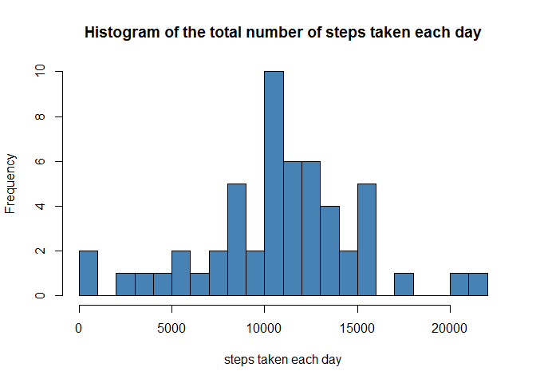
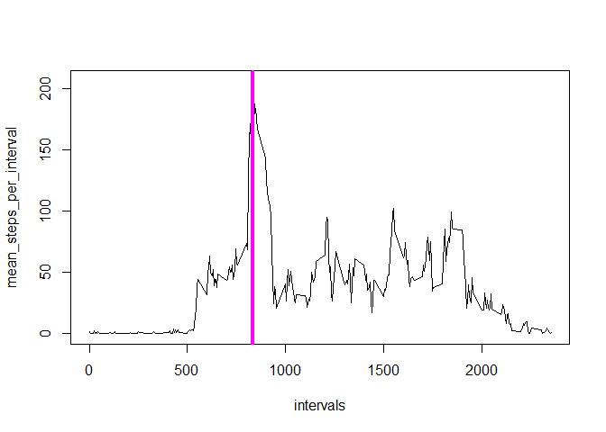
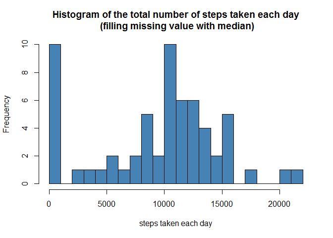
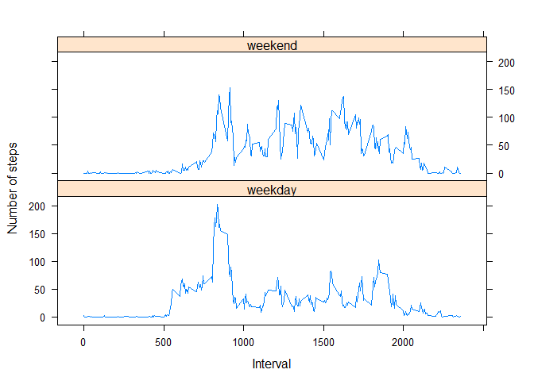

# Reproducible Research: Peer Assessment 1


## Loading and preprocessing the data

```r
## loading the data
activity <- read.csv("activity.csv",
                     header=TRUE,
                     quote = "\"",
                     na.strings = "NA")
## preprocessing the data
#activity$date <- strptime(activity$date, "%Y-%m-%d")
```
## What is mean total number of steps taken per day?
1. Make a histogram of the total number of steps taken each day

```r
## calculate the total number of steps taken each day
steps_per_day <- split(activity$steps, activity$date)
#total_steps_per_day <- lapply(steps_per_day,sum,na.rm = TRUE)
total_steps_per_day <- lapply(steps_per_day,sum)  # ignore the missing values, i.e., do not remove NA

hist(unlist(total_steps_per_day),
     main = "Histogram of the total number of steps taken each day",
     xlab = "steps taken each day",
     breaks = 20,
     col = "steelblue")
```

 

2. Calculate and report the mean and median total number of steps taken per day

```r
mean_steps_per_day <- lapply(total_steps_per_day, mean,na.rm = TRUE)
median_steps_per_day <-lapply(total_steps_per_day, median,na.rm = TRUE)
```
The mean of total number of steps taken per day: 

```
## 2012-10-01 2012-10-02 2012-10-03 2012-10-04 2012-10-05 2012-10-06 
##        NaN        126      11352      12116      13294      15420 
## 2012-10-07 2012-10-08 2012-10-09 2012-10-10 2012-10-11 2012-10-12 
##      11015        NaN      12811       9900      10304      17382 
## 2012-10-13 2012-10-14 2012-10-15 2012-10-16 2012-10-17 2012-10-18 
##      12426      15098      10139      15084      13452      10056 
## 2012-10-19 2012-10-20 2012-10-21 2012-10-22 2012-10-23 2012-10-24 
##      11829      10395       8821      13460       8918       8355 
## 2012-10-25 2012-10-26 2012-10-27 2012-10-28 2012-10-29 2012-10-30 
##       2492       6778      10119      11458       5018       9819 
## 2012-10-31 2012-11-01 2012-11-02 2012-11-03 2012-11-04 2012-11-05 
##      15414        NaN      10600      10571        NaN      10439 
## 2012-11-06 2012-11-07 2012-11-08 2012-11-09 2012-11-10 2012-11-11 
##       8334      12883       3219        NaN        NaN      12608 
## 2012-11-12 2012-11-13 2012-11-14 2012-11-15 2012-11-16 2012-11-17 
##      10765       7336        NaN         41       5441      14339 
## 2012-11-18 2012-11-19 2012-11-20 2012-11-21 2012-11-22 2012-11-23 
##      15110       8841       4472      12787      20427      21194 
## 2012-11-24 2012-11-25 2012-11-26 2012-11-27 2012-11-28 2012-11-29 
##      14478      11834      11162      13646      10183       7047 
## 2012-11-30 
##        NaN
```
The median of total number of steps taken per day:

```
## 2012-10-01 2012-10-02 2012-10-03 2012-10-04 2012-10-05 2012-10-06 
##         NA        126      11352      12116      13294      15420 
## 2012-10-07 2012-10-08 2012-10-09 2012-10-10 2012-10-11 2012-10-12 
##      11015         NA      12811       9900      10304      17382 
## 2012-10-13 2012-10-14 2012-10-15 2012-10-16 2012-10-17 2012-10-18 
##      12426      15098      10139      15084      13452      10056 
## 2012-10-19 2012-10-20 2012-10-21 2012-10-22 2012-10-23 2012-10-24 
##      11829      10395       8821      13460       8918       8355 
## 2012-10-25 2012-10-26 2012-10-27 2012-10-28 2012-10-29 2012-10-30 
##       2492       6778      10119      11458       5018       9819 
## 2012-10-31 2012-11-01 2012-11-02 2012-11-03 2012-11-04 2012-11-05 
##      15414         NA      10600      10571         NA      10439 
## 2012-11-06 2012-11-07 2012-11-08 2012-11-09 2012-11-10 2012-11-11 
##       8334      12883       3219         NA         NA      12608 
## 2012-11-12 2012-11-13 2012-11-14 2012-11-15 2012-11-16 2012-11-17 
##      10765       7336         NA         41       5441      14339 
## 2012-11-18 2012-11-19 2012-11-20 2012-11-21 2012-11-22 2012-11-23 
##      15110       8841       4472      12787      20427      21194 
## 2012-11-24 2012-11-25 2012-11-26 2012-11-27 2012-11-28 2012-11-29 
##      14478      11834      11162      13646      10183       7047 
## 2012-11-30 
##         NA
```

## What is the average daily activity pattern?
1. Make a time series plot (i.e. type = "l") of the 5-minute interval (x-axis) and the average number of steps taken, averaged across all days (y-axis)

```r
steps_per_interval <- split(activity$steps, activity$interval)
mean_steps_per_interval <- lapply(steps_per_interval,mean,na.rm = TRUE)
mean_steps_per_interval <- unlist(mean_steps_per_interval)
intervals <- sort(as.numeric(names(mean_steps_per_interval)))
df <- data.frame(intervals,mean_steps_per_interval)
plot(df,type="l")
abline(v = df[df$mean_steps_per_interval==max(df$mean_steps_per_interval),]$intervals,col="magenta",lwd =4)
```

 

2. Which 5-minute interval, on average across all the days in the dataset, contains the maximum number of steps?

```r
maximum_steps_interval <- df[df$mean_steps_per_interval==max(df$mean_steps_per_interval),]$intervals
```
The 5-minute interval, on average across all the days in the dataset, contains the maximum number of steps:835

## Imputing missing values
1. Calculate and report the total number of missing values in the dataset (i.e. the total number of rows with NAs)

```r
rows_with_NA <- nrow(activity) - sum(complete.cases(activity))
```
total number of missing values in the dataset:2304

2. Devise a strategy for filling in all of the missing values in the dataset. The strategy does not need to be sophisticated. For example, you could use the mean/median for that day, or the mean for that 5-minute interval, etc.

```r
## filling missing values with median for that day
n_total_steps_per_day <- lapply(steps_per_day,sum,na.rm = TRUE)
n_median_steps_per_day <-lapply(n_total_steps_per_day, median,na.rm = TRUE)
filling_missing <- lapply(seq_along(steps_per_day), function(i) replace(steps_per_day[[i]],is.na(steps_per_day[[i]]),n_median_steps_per_day[[i]]))
```
3. Create a new dataset that is equal to the original dataset but with the missing data filled in.

```r
n_activity <- cbind(unlist(filling_missing),activity)
n_activity$steps <- NULL # remove original 'steps' column
colnames(n_activity)[1] <- "steps"
```

4. Make a histogram of the total number of steps taken each day and Calculate and report the mean and median total number of steps taken per day. Do these values differ from the estimates from the first part of the assignment? What is the impact of imputing missing data on the estimates of the total daily number of steps?

```r
## calculate the total number of steps taken each day
#n_steps_per_day <- split(n_activity$steps, n_activity$date)
n_total_steps_per_day <- lapply(steps_per_day,sum,na.rm = TRUE)

hist(unlist(n_total_steps_per_day),
     main = "Histogram of the total number of steps taken each day\n (filling missing value with median)",
     xlab = "steps taken each day",
     breaks = 20,
     col = "steelblue")
```

 


```r
n_mean_steps_per_day <- lapply(n_total_steps_per_day, mean,na.rm = TRUE)
n_median_steps_per_day <-lapply(n_total_steps_per_day, median,na.rm = TRUE)
```
The mean of total number of steps taken per day: 

```
## 2012-10-01 2012-10-02 2012-10-03 2012-10-04 2012-10-05 2012-10-06 
##          0        126      11352      12116      13294      15420 
## 2012-10-07 2012-10-08 2012-10-09 2012-10-10 2012-10-11 2012-10-12 
##      11015          0      12811       9900      10304      17382 
## 2012-10-13 2012-10-14 2012-10-15 2012-10-16 2012-10-17 2012-10-18 
##      12426      15098      10139      15084      13452      10056 
## 2012-10-19 2012-10-20 2012-10-21 2012-10-22 2012-10-23 2012-10-24 
##      11829      10395       8821      13460       8918       8355 
## 2012-10-25 2012-10-26 2012-10-27 2012-10-28 2012-10-29 2012-10-30 
##       2492       6778      10119      11458       5018       9819 
## 2012-10-31 2012-11-01 2012-11-02 2012-11-03 2012-11-04 2012-11-05 
##      15414          0      10600      10571          0      10439 
## 2012-11-06 2012-11-07 2012-11-08 2012-11-09 2012-11-10 2012-11-11 
##       8334      12883       3219          0          0      12608 
## 2012-11-12 2012-11-13 2012-11-14 2012-11-15 2012-11-16 2012-11-17 
##      10765       7336          0         41       5441      14339 
## 2012-11-18 2012-11-19 2012-11-20 2012-11-21 2012-11-22 2012-11-23 
##      15110       8841       4472      12787      20427      21194 
## 2012-11-24 2012-11-25 2012-11-26 2012-11-27 2012-11-28 2012-11-29 
##      14478      11834      11162      13646      10183       7047 
## 2012-11-30 
##          0
```
The median of total number of steps taken per day:

```
## 2012-10-01 2012-10-02 2012-10-03 2012-10-04 2012-10-05 2012-10-06 
##          0        126      11352      12116      13294      15420 
## 2012-10-07 2012-10-08 2012-10-09 2012-10-10 2012-10-11 2012-10-12 
##      11015          0      12811       9900      10304      17382 
## 2012-10-13 2012-10-14 2012-10-15 2012-10-16 2012-10-17 2012-10-18 
##      12426      15098      10139      15084      13452      10056 
## 2012-10-19 2012-10-20 2012-10-21 2012-10-22 2012-10-23 2012-10-24 
##      11829      10395       8821      13460       8918       8355 
## 2012-10-25 2012-10-26 2012-10-27 2012-10-28 2012-10-29 2012-10-30 
##       2492       6778      10119      11458       5018       9819 
## 2012-10-31 2012-11-01 2012-11-02 2012-11-03 2012-11-04 2012-11-05 
##      15414          0      10600      10571          0      10439 
## 2012-11-06 2012-11-07 2012-11-08 2012-11-09 2012-11-10 2012-11-11 
##       8334      12883       3219          0          0      12608 
## 2012-11-12 2012-11-13 2012-11-14 2012-11-15 2012-11-16 2012-11-17 
##      10765       7336          0         41       5441      14339 
## 2012-11-18 2012-11-19 2012-11-20 2012-11-21 2012-11-22 2012-11-23 
##      15110       8841       4472      12787      20427      21194 
## 2012-11-24 2012-11-25 2012-11-26 2012-11-27 2012-11-28 2012-11-29 
##      14478      11834      11162      13646      10183       7047 
## 2012-11-30 
##          0
```
Disccussion:
Thedifference between these new values from the estimates from the first part of the assignment are: there is no more NA in the final output.
And accordingly, since all the NAs are replaced by the median steps of each day, the frequency of 0s has a huge increase.

## Are there differences in activity patterns between weekdays and weekends?
For this part the weekdays() function may be of some help here. Use the dataset with the filled-in missing values for this part.

1. Create a new factor variable in the dataset with two levels -- "weekday" and "weekend" indicating whether a given date is a weekday or weekend day.

```r
n_activity$date <- strptime(n_activity$date, "%Y-%m-%d")
n_activity["weekday"] <- weekdays(n_activity$date)
n_activity["weekday"] <- ifelse(n_activity$weekday %in% c("Sunday","Saturday"),"weekend","weekday")
n_activity$weekday <- as.factor(n_activity$weekday)
```

2. Make a panel plot containing a time series plot (i.e. type = "l") of the 5-minute interval (x-axis) and the average number of steps taken, averaged across all weekday days or weekend days (y-axis). 

```r
library(dplyr);
```

```
## 
## Attaching package: 'dplyr'
## 
## The following object is masked from 'package:stats':
## 
##     filter
## 
## The following objects are masked from 'package:base':
## 
##     intersect, setdiff, setequal, union
```

```r
n_activity$date <- factor(n_activity$date,unique(n_activity$date))
avg_steps <- n_activity %>%
  group_by(interval,weekday) %>%
  summarize(av_st = mean(steps))

library(lattice)
xyplot( av_st ~ interval | weekday,  # weekday is factor
       data = avg_steps,
       type = "l",
       layout = c(1,2),
       xlab = "Interval",
       ylab = "Number of steps")
```

 
